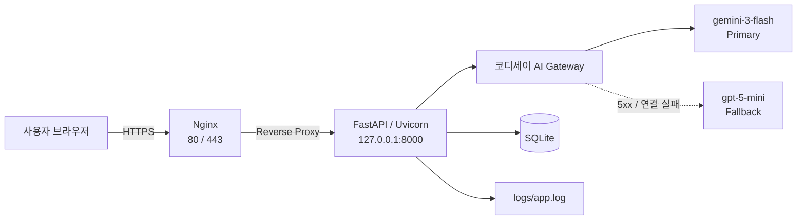
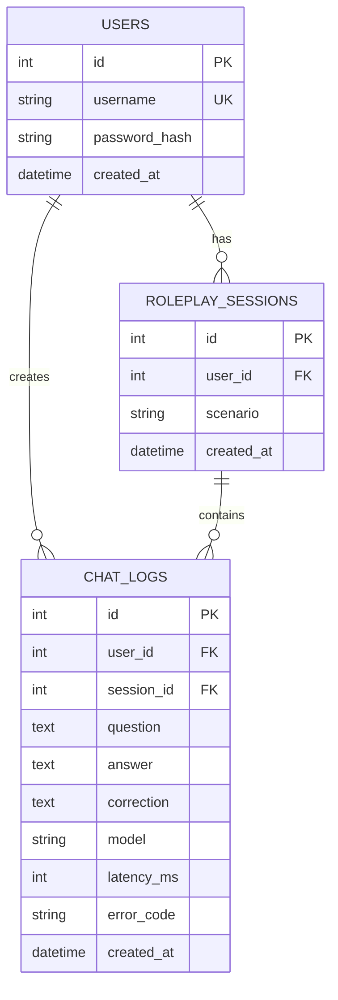
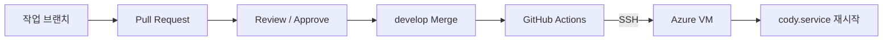

# Cody — 영어 회화 롤플레이 파트너

상황을 고르면 AI가 상대역을 연기하고, 어색한 표현이 나오면 한국어로 교정해 주는 웹 챗봇 서비스입니다.

연습 기록은 사용자별로 저장되며, 지난 대화와 교정 기록을 다시 확인할 수 있습니다.

---

## 1. 프로젝트 개요

### 문제 정의

영어 회화는 실제로 말을 주고받는 연습이 중요하지만, 반복해서 대화할 상대를 구하기는 어렵습니다.

혼자 하는 문법 학습만으로는 실제 발화 연습으로 이어지기 어렵다는 문제를 해결하기 위해 AI 기반 영어 회화 롤플레이 서비스를 구현했습니다.

### 타겟 사용자

말하기 연습 상대가 필요한 한국어 화자 영어 학습자

### 핵심 시나리오

1. 로그인 후 상황(카페·공항·쇼핑 등)을 선택한다.
2. 영어로 말을 걸면 AI가 해당 상황의 상대역으로 답한다.
3. 어색한 표현이 있으면 한국어 교정을 함께 제공한다.
4. 같은 세션에서는 이전 대화 문맥을 유지한다.
5. 지난 대화와 교정 이력을 다시 확인할 수 있다.

---

## 2. 시스템 구조



운영 환경에서는 외부 요청을 Nginx가 받은 뒤 내부의 FastAPI 애플리케이션으로 전달합니다.

FastAPI 애플리케이션은 서버 내부에서 다음 주소로 실행됩니다.

```text
127.0.0.1:8000
```

AI 호출은 코디세이 게이트웨이의 OpenAI 호환 엔드포인트를 사용합니다.

```text
/v1/chat/completions
```

`openai` SDK에 `base_url`을 코디세이 게이트웨이 주소로 지정하여 사용합니다.

### 모델 선택

게이트웨이를 실제 호출해 확인한 제약은 다음과 같습니다.

| 확인한 것 | 결과 |
|---|---|
| Anthropic 계열 (`claude-*`) | OpenAI 호환 키로는 호출되지 않음. Anthropic 방식 키와 `/v1/messages`가 별도로 필요 |
| GPT-5 계열 (`gpt-5*`) | 기본값 외 `temperature`를 거부하므로 해당 파라미터를 제외하여 호출 |

주 모델은 `gemini-3-flash`, 폴백 모델은 다른 공급사의 `gpt-5-mini`를 사용합니다.

폴백은 주 모델이 **5xx 또는 연결 실패**인 경우에만 동작합니다.

타임아웃이 발생한 경우에는 이미 기다린 사용자에게 다시 긴 대기 시간을 주지 않기 위해 폴백하지 않고 `AI_TIMEOUT` 오류를 반환합니다.

### 주요 컴포넌트

| 컴포넌트 | 역할 |
|---|---|
| `app/main.py` | 앱 생성, 세션·요청 로깅 미들웨어, 예외 처리 |
| `app/routers/pages.py` | 화면 라우트 |
| `app/routers/auth.py` | 회원가입 / 로그인 / 로그아웃 |
| `app/routers/chat.py` | 챗 파이프라인 |
| `app/routers/logs.py` | 사용자별 대화·교정·학습 기록 조회 |
| `app/routers/history.py` | 지난 대화 기록 화면 |
| `app/routers/admin_logs.py` | 관리자 운영 로그 조회 API |
| `app/services/ai.py` | AI 게이트웨이 호출 및 오류 처리 |
| `app/services/context.py` | 대화 문맥 구성 |
| `app/deps.py` | 사용자 및 관리자 인증 의존성 |
| `app/logging_config.py` | 콘솔·파일 로그 및 Rotation 설정 |
| `app/models.py` | DB 모델 |
| `app/config.py` | 환경변수 기반 설정 |

**API 키는 서버에만 존재합니다.**

브라우저는 서버의 API만 호출하며 AI API Key를 직접 사용하지 않습니다.

---

## 3. API 명세

### `POST /api/chat` — 대화

로그인이 필요합니다.

요청 예시:

```json
{
  "message": "I want coffee",
  "scenario": "cafe",
  "session_id": null
}
```

`session_id`가 `null`이면 새 롤플레이 세션을 생성합니다.

응답으로 받은 `session_id`를 다음 요청에 전달하면 같은 세션의 대화 문맥을 이어갈 수 있습니다.

응답 예시:

```json
{
  "session_id": 12,
  "chat_id": 87,
  "reply": "Sure! What size would you like?",
  "correction": "\"I want coffee\" 보다 \"Could I get a coffee?\" 가 자연스러워요."
}
```

AI 호출 실패 시 HTTP `503`을 반환합니다.

```json
{
  "error": "AI_TIMEOUT",
  "message": "현재 응답이 지연되고 있어요. 잠시 후 다시 시도해 주세요."
}
```

| 에러 코드 | 상황 |
|---|---|
| `AI_TIMEOUT` | AI 게이트웨이 응답 지연 |
| `AI_ERROR` | AI 호출 실패 또는 빈 응답 |
| `INTERNAL_ERROR` | 그 외 서버 내부 오류 |

입력 검증 실패는 HTTP `422`를 반환합니다.

예:

- 빈 메시지
- 최대 길이 초과
- 지원하지 않는 시나리오

---

### `GET /api/me/chats` — 내 대화 기록

로그인이 필요합니다.

```text
/api/me/chats?limit=50&offset=0&session_id=12
```

현재 로그인한 사용자의 대화 기록만 반환합니다.

---

### `GET /api/me/corrections` — 내 교정 기록

교정이 존재하는 대화만 조회합니다.

지원 파라미터:

```text
limit
offset
scenario
```

---

### `GET /api/me/corrections/by-scenario` — 상황별 교정 통계

롤플레이 상황별 교정 횟수를 반환합니다.

---

### `GET /api/me/sessions` — 내 세션 목록

현재 사용자의 롤플레이 세션 목록을 반환합니다.

각 세션에 대해 다음 정보를 확인할 수 있습니다.

- 대화 턴 수
- 교정 수
- 마지막 대화 시각

---

### `GET /api/me/sessions/{session_id}` — 세션 상세 조회

선택한 세션의 대화 기록 전체를 반환합니다.

다른 사용자의 세션을 요청한 경우 세션 존재 여부가 노출되지 않도록 `404 Not Found`를 반환합니다.

---

### `GET /api/me/stats` — 학습 통계

현재 사용자의 학습 통계를 반환합니다.

- 총 세션 수
- 총 대화 턴 수
- 총 교정 수
- 오류 수
- 평균 AI 응답 시간

---

### `GET /api/admin/logs` — 관리자 운영 로그

관리자 전용 API입니다.

최근 운영 로그를 지정한 개수만큼 조회합니다.

```text
/api/admin/logs?limit=100
```

접근 권한:

```text
비로그인 사용자 → 401
일반 사용자     → 403
관리자          → 200
```

관리자 여부는 `ADMIN_USERNAME` 환경변수와 로그인한 사용자의 `username`을 비교하여 판단합니다.

---

### `GET /health` — 상태 확인

```json
{
  "status": "ok"
}
```

---

## 4. DB 구조

SQLite를 사용하며 기본 DB 파일은 다음 위치에 저장됩니다.

```text
data/chatbot.db
```

### ERD



### `users`

사용자 계정 정보를 저장합니다.

| 필드 | 설명 |
|---|---|
| `id` | 사용자 PK |
| `username` | 로그인 사용자명 |
| `password_hash` | 해시된 비밀번호 |
| `created_at` | 사용자 생성 시각 |

### `roleplay_sessions`

롤플레이 한 번의 세션을 저장합니다.

세션을 별도로 두는 이유는 **대화 문맥을 롤플레이 단위로 분리하기 위해서**입니다.

예를 들어 카페 대화를 하다가 공항 롤플레이를 새로 시작하면 카페에서 했던 대화가 새로운 문맥에 포함되지 않습니다.

| 필드 | 설명 |
|---|---|
| `id` | 세션 PK |
| `user_id` | 사용자 FK |
| `scenario` | 롤플레이 상황 |
| `created_at` | 세션 생성 시각 |

### `chat_logs`

사용자와 AI 사이의 대화 한 턴을 저장합니다.

| 필드 | 설명 |
|---|---|
| `id` | 로그 PK |
| `user_id` | 사용자 FK |
| `session_id` | 세션 FK |
| `question` | 사용자 발화 |
| `answer` | AI 응답 |
| `correction` | 표현 교정 |
| `model` | 사용된 AI 모델 |
| `latency_ms` | AI 응답 소요 시간 |
| `error_code` | 오류 코드 |
| `created_at` | 대화 시각 |

---

## 5. DB 확인 가이드

SQLite CLI를 이용해 다음 명령을 실행합니다.

```bash
sqlite3 data/chatbot.db < scripts/check_logs.sql
```

다음 정보를 확인할 수 있습니다.

- 사용자 목록
- 최근 대화 20건
- 사용자별 누적 통계

웹에서는 다음 API로 현재 로그인 사용자의 기록을 확인할 수 있습니다.

```text
GET /api/me/chats
```

---

## 6. 실행 방법

### Python

Python 3.12 이상이 필요합니다.

### 가상환경 생성

```bash
python -m venv .venv
```

Linux / macOS:

```bash
source .venv/bin/activate
```

Windows:

```powershell
.\.venv\Scripts\activate
```

### 패키지 설치

```bash
python -m pip install -r requirements.txt
```

### 환경변수 설정

```bash
cp .env.example .env
```

Windows PowerShell:

```powershell
Copy-Item .env.example .env
```

필요한 값을 `.env`에 입력합니다.

### 서버 실행

```bash
uvicorn app.main:app --reload
```

로컬 접속 주소:

```text
http://127.0.0.1:8000
```

`AI_MOCK=true`로 설정하면 실제 AI API를 호출하지 않고 테스트할 수 있습니다.

---

## 7. 환경 변수

| 키 | 설명 |
|---|---|
| `AI_API_KEY` | 코디세이 콘솔에서 발급한 AI API Key |
| `AI_BASE_URL` | 코디세이 AI Gateway 기본 URL |
| `AI_MODEL` | 주 AI 모델 |
| `AI_FALLBACK_MODEL` | 주 모델 실패 시 사용할 보조 모델 |
| `AI_TEMPERATURE` | 응답 생성 다양성 설정 |
| `AI_TIMEOUT` | AI 요청 제한 시간(초) |
| `AI_MAX_CONTEXT_TURNS` | 문맥에 포함할 최근 대화 턴 수 |
| `AI_MOCK` | `true`이면 실제 AI 호출 없이 Mock 응답 사용 |
| `SESSION_SECRET_KEY` | 로그인 세션 서명 키 |
| `DATABASE_URL` | DB 연결 주소 |
| `LOG_LEVEL` | 애플리케이션 로그 레벨 |
| `ADMIN_USERNAME` | 관리자 계정 username |
| `MAX_MESSAGE_LENGTH` | 사용자 입력 최대 길이 |
| `DEV_AUTH_BYPASS` | 개발용 인증 우회 기능 |

기본 DB:

```env
DATABASE_URL=sqlite:///./data/chatbot.db
```

운영 환경에서는 반드시 다음과 같이 설정합니다.

```env
DEV_AUTH_BYPASS=false
```

실제 API Key와 Secret 값은 `.env`에만 저장하며 Git 저장소에 포함하지 않습니다.

---

## 8. 테스트 및 코드 품질

전체 테스트:

```bash
pytest -q
```

Ruff 검사:

```bash
ruff check .
```

자동 수정 가능한 Ruff 오류 수정:

```bash
ruff check --fix .
```

---

## 9. 운영 로그

다음과 같은 주요 운영 이벤트를 로그로 기록합니다.

```text
request_received
ai_call_start
ai_call_success
ai_call_failed
db_save_success
db_save_failed
```

로그는 콘솔과 파일에 함께 기록됩니다.

```text
logs/app.log
```

### 로그 Rotation

`RotatingFileHandler`를 사용하여 로그 파일이 무한히 커지는 것을 방지합니다.

현재 설정:

```text
로그 파일 최대 크기: 5 MB
백업 파일: 최대 5개
```

예:

```text
logs/
├── app.log
├── app.log.1
├── app.log.2
├── app.log.3
├── app.log.4
└── app.log.5
```

`logs/`는 `.gitignore`를 통해 저장소에서 제외합니다.

---

## 10. DB 백업 및 복구

### 백업

```bash
python scripts/backup_db.py
```

백업 파일은 다음 형식으로 생성됩니다.

```text
backups/chatbot_YYYYMMDD_HHMMSS.db
```

### 복구

```bash
python scripts/restore_db.py backups/<백업파일명>.db
```

기존 DB를 바로 덮어쓰지 않도록 복구 직전에 현재 DB를 한 번 더 백업합니다.

```text
backups/pre_restore_YYYYMMDD_HHMMSS.db
```

### DB 무결성 확인

```bash
python -c "import sqlite3; conn=sqlite3.connect('data/chatbot.db'); print(conn.execute('PRAGMA integrity_check;').fetchone()[0]); conn.close()"
```

정상 결과:

```text
ok
```

실제 DB 파일과 백업 파일은 Git 저장소에 포함하지 않습니다.

---

## 11. 운영 서버 및 배포

운영 서버는 Ubuntu 기반 Azure VM을 사용합니다.

프로젝트 위치:

```text
/home/azureuser/cody_chatbot
```

FastAPI 애플리케이션은 systemd 서비스로 관리합니다.

```text
cody.service
```

서비스 상태 확인:

```bash
sudo systemctl status cody.service
```

재시작:

```bash
sudo systemctl restart cody.service
```

저장소에는 서버 재구성을 위한 설정 파일을 함께 관리합니다.

```text
deploy/
├── cody.service
├── nginx.conf
└── README.md
```

---

## 12. Nginx 및 HTTPS

Nginx가 외부 요청을 받고 FastAPI로 전달합니다.

```text
사용자
  ↓
HTTP :80 / HTTPS :443
  ↓
Nginx
  ↓
127.0.0.1:8000
  ↓
FastAPI
```

운영 서비스 주소:

```text
https://cody-chatbot.koreacentral.cloudapp.azure.com
```

HTTP 요청은 HTTPS로 리다이렉트됩니다.

Let's Encrypt와 Certbot을 이용해 HTTPS 인증서를 관리합니다.

### 인증서 자동 갱신 확인

```bash
sudo systemctl status certbot.timer --no-pager
```

갱신 테스트:

```bash
sudo certbot renew --dry-run
```

새 서버에서는 인증서 파일이 먼저 존재해야 하므로 **Certbot으로 인증서를 발급한 뒤 HTTPS nginx 설정을 적용**해야 합니다.

상세 절차:

```text
deploy/README.md
```

---

## 13. GitHub Actions 자동 배포

`develop` 브랜치에 변경사항이 Merge되면 GitHub Actions가 자동으로 운영 서버에 배포합니다.



자동 배포 과정:

1. GitHub Actions 실행
2. SSH로 Azure VM 접속
3. `develop` 브랜치 최신 코드 가져오기
4. `requirements.txt` 의존성 설치
5. `cody.service` 재시작
6. 서비스 활성 상태 확인

GitHub Actions에서 사용하는 서버 정보는 GitHub Secrets에 저장합니다.

```text
SERVER_HOST
SERVER_USER
SSH_PRIVATE_KEY
```

SSH Private Key는 코드나 저장소에 포함하지 않습니다.

---

## 14. 보안 및 접근 제어

### 사용자 데이터

사용자 기록 API의 모든 조회는 현재 로그인한 사용자의 ID를 기준으로 제한합니다.

예:

```text
ChatLog.user_id == 현재 로그인 사용자의 ID
```

따라서 다른 사용자의 대화 기록이나 교정 기록을 조회할 수 없습니다.

### 관리자 API

관리자 운영 로그 API는 `ADMIN_USERNAME`과 현재 로그인 사용자의 username을 비교하여 접근을 제한합니다.

### 저장소에 포함하지 않는 정보

다음 정보는 Git에 저장하지 않습니다.

```text
.env
API Key
SESSION_SECRET_KEY
SSH Private Key
실제 SQLite DB
DB 백업 파일
운영 로그 파일
Let's Encrypt Private Key
```

---

## 15. 팀 구성원 역할

| 구분 | 담당 | 범위 |
|---|---|---|
| A | 인프라 · DB · 배포 | DB 스키마, Azure VM, nginx/systemd, 자동 배포, HTTPS, 로그 파일, DB 백업·복구, 관리자 운영 로그 API, ERD, 배포 문서 |
| B | 인증 · 웹 UI | 회원가입/로그인, 접근 제어, 템플릿·정적 파일 |
| C | AI 파이프라인 · 운영 | AI 게이트웨이 연동, 문맥 전략, 사용자 대화 로그 저장·조회, 교정 기록, 학습 통계 |

트랙별 세부 내용은 [`docs/HANDOFF.md`](docs/HANDOFF.md)를 참고합니다.

---

## 16. 협업 규칙

브랜치 구조:

```text
main
develop
feat/*
chore/*
docs/*
```

작업 흐름:

```text
Issue 생성
→ 작업 브랜치 생성
→ Commit / Push
→ Pull Request
→ 팀원 Review / Approve
→ CI 통과
→ develop Merge
```

- `main`, `develop`에 직접 Push하지 않습니다.
- 모든 변경사항은 Pull Request를 통해 반영합니다.
- PR은 팀원 최소 1명의 승인을 받습니다.
- CI가 통과한 뒤 Merge합니다.
- 개인별 커밋 이력을 보존하기 위해 squash merge를 사용하지 않습니다.